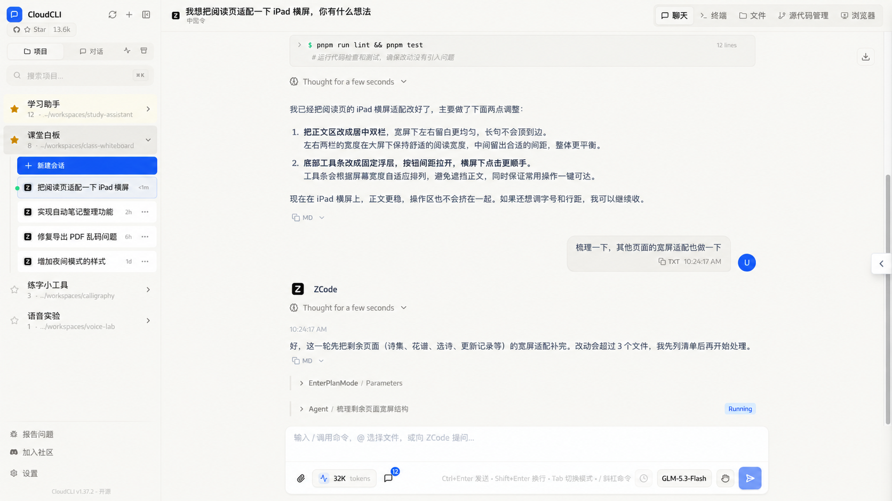
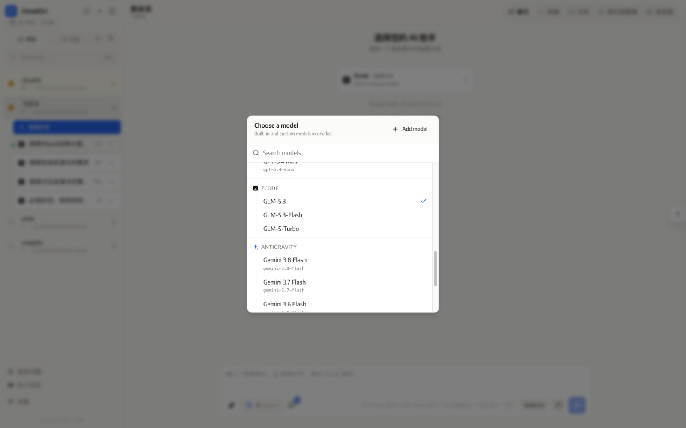
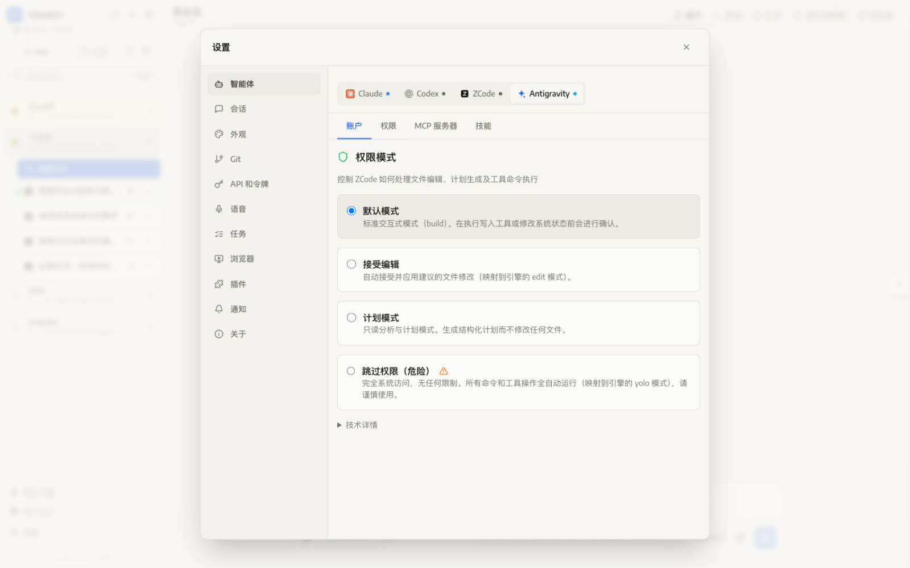
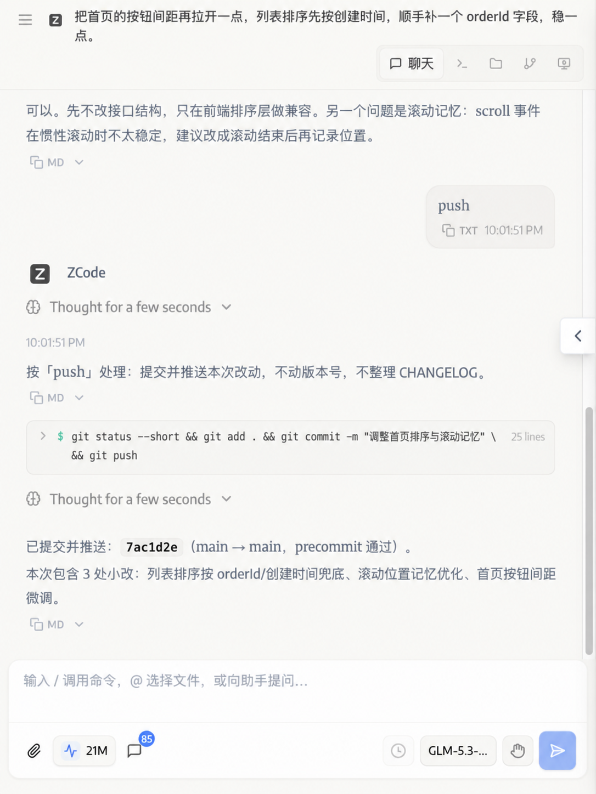

<div align="center">
<<<<<<< HEAD


# CloudCLI

**多引擎 AI 编码代理的 Web 控制台**

在浏览器（或手机 PWA）里统一驱动 Claude Code、Codex、Cursor CLI、OpenCode、ZCode、Antigravity 六家编码引擎：
实时流式会话、工具调用可视化、权限审批、终端 / 文件 / Git / 浏览器面板，一个都不缺。

本仓库 fork 自 [siteboon/claudecodeui](https://github.com/siteboon/claudecodeui)（Claude Code UI），在其基础上做了大量引擎接入、架构与性能增强（见下文）。

</div>

---

| 主界面（实时会话） | 引擎与统一模型库 |
| --- | --- |
|  |  |

| 引擎权限模式 | 移动端 / PWA |
| --- | --- |
|  |  |

## 核心体验

- **多引擎同框**：一套 UI 管理所有引擎的会话，按项目聚合，随时切换；会话原件保留在各引擎自己的目录里，CloudCLI 只做索引与同步。
- **实时流式**：WebSocket 直播文本、思考块、工具调用卡片；断线自动重连并从 `lastSeq` 精确补发，不丢一条消息。
- **工作台面板**：内置终端（node-pty）、文件树与代码编辑器、Git 状态/提交、浏览器自动化面板。
- **随时随地**：PWA 可安装、移动端自适应、Web Push 通知；服务端绑 `0.0.0.0`，局域网 / Tailscale 直连。

## 相对上游的增强

> 上游 claudecodeui 提供 Claude / Codex / Cursor 三家接入和聊天基座。本 fork 在此之上的主要工作：

### 1. 新增两家原生引擎

- **ZCode（智谱 GLM）**：完整的协议层接入——协议编解码（codec）、引擎子进程守护（崩溃熔断、自动重启）、请求路由，流式工具参数、思考块归组、四档权限模式、会话落盘同步、token 用量统计。
- **Antigravity（Google Gemini / `agy` CLI）**：print 模式集成、`--add-dir` 沙箱目录授权、断流自动续跑、brain 文档只读暴露、token 过期检测与账号状态识别、5 小时 / 周配额查询。

### 2. Provider 框架重构（六家引擎同一套契约）

- `IProvider` 七切面（runtime / models / auth / mcp / skills / sessions / sessionSynchronizer）+ 抽象基类，新引擎按切面拼装，不写整块胶水。
- **能力矩阵**：每家引擎声明自己的能力（权限、fork、编辑、token 用量……），前端完全按矩阵渲染，**零 provider 条件分支**。
- **统一模型目录 API**：内置 + 自定义模型合并为一个列表（见截图），前端一个下拉选择所有引擎的模型与推理力度。
- 引擎二进制定位工厂（env 覆盖 → PATH → 平台默认路径，带 TTL 缓存）、SQLite 会话同步器基类（watch → 高水位增量 → upsert 广播）。

### 3. 聊天链路的稳定性与性能

- 框架无关的会话时间线 store：WS 帧零 React 更新、消息行身份稳定（滚动不跳动）、历史分页 + 实时流两路合并。
- 流式渲染优化：思考块 / 工具卡片按稳定 id 归组 upsert、增量 Markdown 解析、视口懒挂载。
- 权限批准链路加固：请求 / 应答双通道、断线后挂起请求恢复、权限僵尸卡根治。
- 排队消息自动补发、会话侧边栏增量广播（`session_upserted`）。

### 4. 其他

- Token 用量与配额面板（ZCode / Antigravity / Codex 配额同框展示）。
- PWA 冷启动会话恢复、前端版本自检与更新提示。
- 安全加固：上传资产白名单、`file:` 链接白名单只读访问、JWT 认证密钥自动生成入库。
- 简繁中文界面文案补全（i18n 11 种语言）。

## 快速开始

```bash
npm install

# 构建前端 + 后端
npm run build

# 启动（单进程：Express 同时提供 API、WebSocket 与前端静态资源）
npm run server
# → http://localhost:3001（默认绑 0.0.0.0，局域网可直连）
```

首次打开进入账号初始化，之后登录使用。开发模式用 `npm run dev`（Vite HMR 跑 5173，API 代理到 3001）。

### 引擎依赖

Web UI 是壳，各引擎需要对应 CLI 就位（按需安装，不用的可以不管）：

| 引擎 | 依赖 |
| --- | --- |
| Claude | `claude` CLI 并登录 |
| Codex | `codex` CLI 并登录 |
| Cursor | Cursor CLI |
| OpenCode | `opencode` CLI |
| ZCode | ZCode 桌面 App（引擎随 App 分发） |
| Antigravity | Google Antigravity（`agy` CLI）并登录 |

### 常用环境变量（均可省略）

| 变量 | 默认 | 说明 |
| --- | --- | --- |
| `SERVER_PORT` | `3001` | API + WebSocket + 静态资源端口 |
| `HOST` | `0.0.0.0` | 绑定地址；仅本机使用可改 `127.0.0.1` |
| `DATABASE_PATH` | `~/.cloudcli/auth.db` | 账号 / 会话元数据 / 应用配置（SQLite） |
| `CLAUDE_CLI_PATH` | `claude` | Claude CLI 自定义路径 |

运行时数据在 `~/.cloudcli/`（数据库、上传资产、运行标记）。上传的图片 / 文件落 `~/.cloudcli/assets`；会话对话原件始终在各引擎自己的数据目录，不重复占用空间。

## 架构文档（开发必读）

本 fork 的核心模块架构说明在 **`docs/core/`**（中文）。**改动对应模块时必须同步更新文档**（见根目录 `AGENTS.md` 的约定）：

| 文档 | 内容 |
| --- | --- |
| [`docs/core/overview.md`](docs/core/overview.md) | 系统全景：进程拓扑、目录地图、数据与持久化、认证、构建部署 |
| [`docs/core/providers.md`](docs/core/providers.md) | Provider 架构与“新增一个引擎”的完整步骤 |
| [`docs/core/chat.md`](docs/core/chat.md) | 聊天链路：消息生命周期、帧协议、权限批准、前端时间线 store |
| [`docs/core/frontend.md`](docs/core/frontend.md) | 前端架构：状态分层、性能守则、i18n、PWA |

上游自带的聊天运行时深度文档在 [`docs/architecture/`](docs/architecture/README.md)（英文，六篇），原始英文 README 备份在 [`docs/README.upstream.md`](docs/README.upstream.md)。

## 部署提示

生产环境推荐用 PM2 托管单进程 `node dist-server/server/index.js`（本仓库的运维约定见 `AGENTS.md`）。改代码后 `npm run build` 会原子晋升 `dist-server` 产物，重启即生效。

## License

AGPL-3.0-or-later（继承上游）。
=======
 
 <h1>Cloud CLI (aka Claude Code UI)</h1>
 <p>A desktop and mobile UI for <a href="https://docs.anthropic.com/en/docs/claude-code">Claude Code</a>, <a href="https://docs.cursor.com/en/cli/overview">Cursor CLI</a>, and <a href="https://developers.openai.com/codex">Codex</a>.<br>Use it locally or remotely to view your active projects and sessions from everywhere.</p>
</div>

<p align="center">
 <a href="https://cloudcli.ai">CloudCLI Cloud</a> · <a href="https://cloudcli.ai/docs">Documentation</a> · <a href="https://discord.gg/buxwujPNRE">Discord</a> · <a href="https://github.com/siteboon/claudecodeui/issues">Bug Reports</a> · <a href="CONTRIBUTING.md">Contributing</a>
</p>

<p align="center">
 <a href="https://cloudcli.ai"></a>
 <a href="https://discord.gg/buxwujPNRE"></a>
 <br><br>
 <a href="https://trendshift.io/repositories/15586" target="_blank"></a>
</p>

<div align="right"><i><b>English</b> · <a href="./docs/README.ru.md">Русский</a> · <a href="./docs/README.de.md">Deutsch</a> · <a href="./docs/README.ko.md">한국어</a> · <a href="./docs/README.zh-CN.md">简体中文</a> · <a href="./docs/README.zh-TW.md">繁體中文</a> · <a href="./docs/README.ja.md">日本語</a> · <a href="./docs/README.tr.md">Türkçe</a></i></div>

---

## Screenshots

<div align="center">

<table>
<tr>
<td align="center">
<h3>Desktop View</h3>

<br>
<em>Main interface showing project overview and chat</em>
</td>
<td align="center">
<h3>Mobile Experience</h3>

<br>
<em>Responsive mobile design with touch navigation</em>
</td>
</tr>
<tr>
<td align="center" colspan="2">
<h3>CLI Selection</h3>

<br>
<em>Select between Claude Code, Cursor CLI and Codex</em>
</td>
</tr>
</table>


</div>

## Features

- **Responsive Design** - Works seamlessly across desktop, tablet, and mobile so you can also use Agents from mobile 
- **Interactive Chat Interface** - Built-in chat interface for seamless communication with the Agents
- **Integrated Shell Terminal** - Direct access to the Agents CLI through built-in shell functionality
- **File Explorer** - Interactive file tree with syntax highlighting and live editing
- **Git Explorer** - View, stage and commit your changes. You can also switch branches 
- **Browser Use** - Open browser sessions for web research, testing, and agent-driven browser tasks
- **Session Management** - Resume conversations, manage multiple sessions, and track history
- **Plugin System** - Extend CloudCLI with custom plugins — add new tabs, backend services, and integrations. [Build your own →](https://github.com/cloudcli-ai/cloudcli-plugin-starter)
- **TaskMaster AI Integration** *(Optional)* - Advanced project management with AI-powered task planning, PRD parsing, and workflow automation
- **Model Compatibility** - Works with Claude and GPT model families (the full list of supported models is available at runtime via `GET /api/providers/:provider/models`)


## Quick Start

### CloudCLI Cloud (Recommended)

The fastest way to get started — no local setup required. Get a fully managed, containerized development environment accessible from the web, mobile app, API, or your favorite IDE.

**[Get started with CloudCLI Cloud](https://cloudcli.ai)**

### Self-Hosted (Open source)

#### npm

Try CloudCLI UI instantly with **npx** (requires **Node.js** v22+):

```
npx @cloudcli-ai/cloudcli
```

Or install **globally** for regular use:

```
npm install -g @cloudcli-ai/cloudcli
cloudcli
```

Open `http://localhost:3001` — all your existing sessions are discovered automatically.

Visit the **[documentation →](https://cloudcli.ai/docs)** for full configuration options, PM2, remote server setup and more.

#### Docker Sandboxes (Experimental)

Run agents in isolated sandboxes with hypervisor-level isolation. Starts Claude Code by default. Requires the [`sbx` CLI](https://docs.docker.com/ai/sandboxes/get-started/).

```
npx @cloudcli-ai/cloudcli@latest sandbox ~/my-project
```

Supports Claude Code and Codex. See the [sandbox docs](docker/) for setup and advanced options.

### Desktop Companion App

CloudCLI Desktop is an optional native companion for CloudCLI Cloud and Local CloudCLI. It ships from this repository's GitHub Releases and keeps CloudCLI available from your menu bar or tray.

- **[macOS](https://cloudcli.ai/download/macos)**
- **[Windows](https://cloudcli.ai/download/windows)**
- **[Download page](https://cloudcli.ai/download)** · **[GitHub Releases and checksums](https://github.com/siteboon/claudecodeui/releases)**

Use it to open CloudCLI Cloud environments, switch between local and remote workspaces, and copy mobile/browser URLs. To work locally, choose **Local CloudCLI** in the desktop app; it will use your running local server or start one for you.


---

## Which option is right for you?

CloudCLI UI is the open source UI layer that powers CloudCLI Cloud. You can self-host it on your own machine, run it in a Docker sandbox for isolation, or use CloudCLI Cloud for a fully managed environment.

| | Self-Hosted (npm) | Self-Hosted (Docker Sandbox) *(Experimental)* | CloudCLI Cloud |
|---|---|---|---|
| **Best for** | Local agent sessions on your own machine | Isolated agents with web/mobile IDE | Teams who want agents in the cloud |
| **How you access it** | Browser via `[yourip]:port` | Browser via `localhost:port` | Browser, any IDE, REST API, n8n |
| **Setup** | `npx @cloudcli-ai/cloudcli` | `npx @cloudcli-ai/cloudcli@latest sandbox ~/project` | No setup required |
| **Isolation** | Runs on your host | Hypervisor-level sandbox (microVM) | Full cloud isolation |
| **Machine needs to stay on** | Yes | Yes | No |
| **Mobile access** | Any browser on your network | Any browser on your network | Any device |
| **Desktop companion** | Optional. Choose Local CloudCLI | Optional. Choose Local CloudCLI | Optional. Opens cloud environments |
| **Agents supported** | Claude Code, Cursor CLI, Codex | Claude Code, Codex | Claude Code, Cursor CLI, Codex |
| **File explorer and Git** | Yes | Yes | Yes |
| **MCP configuration** | Synced with `~/.claude` | Managed via UI | Managed via UI |
| **REST API** | Yes | Yes | Yes |
| **Team sharing** | No | No | Yes |
| **Platform cost** | Free, open source | Free, open source | Starts at €7/month |

> All options use your own AI subscriptions (Claude, Cursor, etc.) — CloudCLI provides the environment, not the AI.

---

## Security & Tools Configuration

**🔒 Important Notice**: All Claude Code tools are **disabled by default**. This prevents potentially harmful operations from running automatically.

### Enabling Tools

To use Claude Code's full functionality, you'll need to manually enable tools:

1. **Open Tools Settings** - Click the gear icon in the sidebar
2. **Enable Selectively** - Turn on only the tools you need
3. **Apply Settings** - Your preferences are saved locally

<div align="center">


*Tools Settings interface - enable only what you need*

</div>

**Recommended approach**: Start with basic tools enabled and add more as needed. You can always adjust these settings later.

---

## Plugins

CloudCLI has a plugin system that lets you add custom tabs with their own frontend UI and optional Node.js backend. Install plugins from git repos directly in **Settings > Plugins**, or build your own.

### Available Plugins

| Plugin | Description |
|---|---|
| **[Project Stats](https://github.com/cloudcli-ai/cloudcli-plugin-starter)** | Shows file counts, lines of code, file-type breakdown, largest files, and recently modified files for your current project |
| **[Web Terminal](https://github.com/cloudcli-ai/cloudcli-plugin-terminal)** | Full xterm.js terminal with multi-tab support |
| **[Claude Watch](https://github.com/satsuki19980613/cloudcli-claude-watch)** | Watches long-running Claude Code sessions for hangs and exposes process controls |
| **[CloudCLI Scheduler](https://github.com/grostim/cloudcli-cron)** | Create workspace-scoped scheduled prompts and execute them through a local CLI such as Codex or Claude Code |
| **[PRISM CloudCLI](https://github.com/jakeefr/cloudcli-plugin-prism)** | Session intelligence for Claude Code inside CloudCLI, including token burn visibility |
| **[Sessions](https://github.com/strykereye2/cloudcli-plugin-session-manager)** | View, manage, and kill active Claude Code sessions |
| **[Token Cost Calculator](https://github.com/NightmareAway/cloudcli-plugin-token-cost-calculator)** | Calculate API costs from model prices and token usage, with preset model pricing support |
| **[Task Queue](https://github.com/TadMSTR/cloudcli-plugin-task-queue)** | Task queue dashboard to view, filter, and launch agent tasks |
| **[GitHub Issues Board](https://github.com/szmidtpiotr/claude-github-issue)** | Kanban board for GitHub Issues with bidirectional TaskMaster sync and /github-task CLI skill auto-install |

### Build Your Own

**[Plugin Starter Template →](https://github.com/cloudcli-ai/cloudcli-plugin-starter)** — fork this repo to create your own plugin. It includes a working example with frontend rendering, live context updates, and RPC communication to a backend server.

**[Plugin Documentation →](https://cloudcli.ai/docs/plugin-overview)** — full guide to the plugin API, manifest format, security model, and more.

---
## FAQ

<details>
<summary>How is this different from Claude Code Remote Control?</summary>

Claude Code Remote Control lets you send messages to a session already running in your local terminal. Your machine has to stay on, your terminal has to stay open, and sessions time out after roughly 10 minutes without a network connection.

CloudCLI UI and CloudCLI Cloud extend Claude Code rather than sit alongside it — your MCP servers, permissions, settings, and sessions are the exact same ones Claude Code uses natively. Nothing is duplicated or managed separately.

Here's what that means in practice:

- **All your sessions, not just one** — CloudCLI UI auto-discovers every session from your `~/.claude` folder. Remote Control only exposes the single active session to make it available in the Claude mobile app.
- **Your settings are your settings** — MCP servers, tool permissions, and project config you change in CloudCLI UI are written directly to your Claude Code config and take effect immediately, and vice versa.
- **Works with more agents** — Claude Code, Cursor CLI and Codex, not just Claude Code.
- **Full UI, not just a chat window** — file explorer, Git integration, MCP management, and a shell terminal are all built in.
- **CloudCLI Cloud runs in the cloud** — close your laptop, the agent keeps running. No terminal to babysit, no machine to keep awake.

</details>

<details>
<summary>Do I need to pay for an AI subscription separately?</summary>

Yes. CloudCLI provides the environment, not the AI. You bring your own Claude, Cursor, or Codex subscription. CloudCLI Cloud starts at €7/month for the hosted environment on top of that.

</details>

<details>
<summary>Can I use CloudCLI UI on my phone?</summary>

Yes. For self-hosted, run the server on your machine and open `[yourip]:port` in any browser on your network. For CloudCLI Cloud, open it from any device — no VPN, no port forwarding, no setup. A native app is also in the works.

</details>

<details>
<summary>Will changes I make in the UI affect my local Claude Code setup?</summary>

Yes, for self-hosted. CloudCLI UI reads from and writes to the same `~/.claude` config that Claude Code uses natively. MCP servers you add via the UI show up in Claude Code immediately and vice versa.

</details>

---

## Community & Support

- **[Documentation](https://cloudcli.ai/docs)** — installation, configuration, features, and troubleshooting
- **[Discord](https://discord.gg/buxwujPNRE)** — get help and connect with other users
- **[GitHub Issues](https://github.com/siteboon/claudecodeui/issues)** — bug reports and feature requests
- **[Contributing Guide](CONTRIBUTING.md)** — how to contribute to the project

## License

GNU Affero General Public License v3.0 or later (AGPL-3.0-or-later) — see [LICENSE](LICENSE) for the full text, including additional terms under Section 7.

This project is open source and free to use, modify, and distribute under the AGPL-3.0-or-later license. If you modify this software and run it as a network service, you must make your modified source code available to users of that service.

CloudCLI UI - (https://cloudcli.ai).

## Acknowledgments

### Built With
- **[Claude Code](https://docs.anthropic.com/en/docs/claude-code)** - Anthropic's official CLI
- **[Cursor CLI](https://docs.cursor.com/en/cli/overview)** - Cursor's official CLI
- **[Codex](https://developers.openai.com/codex)** - OpenAI Codex
- **[React](https://react.dev/)** - User interface library
- **[Vite](https://vitejs.dev/)** - Fast build tool and dev server
- **[Tailwind CSS](https://tailwindcss.com/)** - Utility-first CSS framework
- **[CodeMirror](https://codemirror.net/)** - Advanced code editor
- **[TaskMaster AI](https://github.com/eyaltoledano/claude-task-master)** *(Optional)* - AI-powered project management and task planning


### Sponsors
- [Siteboon - AI powered website builder](https://siteboon.ai)
---

<div align="center">
 <strong>Made with care for the Claude Code, Cursor and Codex community.</strong>
</div>
>>>>>>> v1.37.3
