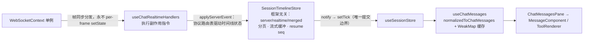

# 聊天链路（Chat Pipeline）

> 基准：2.3.3 / 2026-09-18
> **核心文档**：改动 `server/modules/websocket/**` 或 `src/modules/chat/**` 时**必须同步更新本文**。
> 普通 bug 修复不动架构的不需要更新（提交时走 `--no-verify`，见 `AGENTS.md`）。

一个值得先记住的模型：**同一段对话有两条路**。实时事件从 WebSocket 下来，持久化历史从 REST 上去，前端 store 把两者分数组保存、合并渲染。这个区域的大部分诡异行为（重复消息、闪空、乱序）都是两条路不一致造成的。

深度细节（帧表、握手、滚动、工具视图的逐文件分析）在上游自带文档 `docs/architecture/`（英文，6 篇）。**注意**：其中《04 message store》《05 scrolling》写作早于本 fork 的重构，消息存储与滚动以本文为准。

## 发送侧：一次 turn 的旅程（服务端）

| 步骤 | 位置 |
| --- | --- |
| 会话先创建（REST） | `POST /api/providers/sessions` → `sessionsService.createAppSession` → `sessionsDb`；app session id 是服务端生成的 `randomUUID`，URL/帧/store 全用它 |
| `chat.send` 入口 | `server/modules/websocket/services/chat-websocket.service.ts` 的 `handleChatSend`：`resolveSendTarget`（会话行以 DB 为准，不信任客户端）→ `dispatchRun`（附件过滤只放行 `~/.cloudcli/assets` 直接子文件、记录 model/effort） |
| 运行登记 | `chat-run-registry.service.ts`：`startRun` / `replayEvents` / `completeRunIfCurrent`；**run 属于服务端不属于 socket**——断线存活、多端同看、无观察者也能跑；完成后事件缓冲保留约 5 分钟供补发 |
| 统一分发 | `server/modules/providers/services/provider-runtime.service.ts` → `IProviderRuntime.run(command, options, writer, context)` |
| 出站写入 | `chat-session-writer.service.ts`（`ChatSessionWriter`）：**先过线上契约闸门**（`server/shared/normalized-message-contract.ts`：信封坏了整条丢、协议未声明的字段剥掉并点名记录，见 [providers.md](./providers.md)），再吞掉 `session_created`、把 provider 原生 id 重映射为 app session id、给每事件打**单调 `seq`**、扇出给所有 watching socket |
| 终态 | 每次运行**恰好一个 `complete`**（成功/失败/中止都是）；`error` 是信息性行，不终止 run |

## 断线恢复

- `seq` 由 run registry 按 session 维护单调水位：跨 run 续数、不随缓冲驱逐失效，服务端单方定义，客户端只透传（取 max 对账）。重连后发 `chat.subscribe`（带 `lastSeq`）→ 活跃 run 从缓冲精确补发；ack 带权威 `lastSeq` 与 `stale` 标志——`stale: true` 表示 `lastSeq` 已落在缓冲窗之前（5000 条上限 / 5 分钟保留），客户端补一次 REST 刷新。完成态 run 不 replay，走 REST。
- WS 鉴权用 query token 或 Authorization 头（`websocket-auth.service.ts`）；30s 心跳在 `websocket-server.service.ts`。
- `websocket_reconnected` 帧是前端 `src/shared/context/WebSocketContext.tsx` 本地合成的，用于各订阅方追赶。

## 权限批准

- 引擎运行时发 `permission_request` 帧 → 前端 `src/modules/chat/context/PermissionContext.tsx` → 用户应答 `chat.permission-response` → `chat-websocket.service.ts` `handlePermissionResponse` → `providerRuntimeService.resolveToolApproval` 广播到各引擎的 `permissions` 网关（`server/shared/types.ts` `ProviderRuntimePermissionGateway`）。
- `chat.subscribe` 应答（`chat_subscribed`）携带处理中状态与挂起权限，多标签/重连后权限卡不丢（历史教训：挂起列表裸字符串契约破裂产生"僵尸权限卡"，已由形状校验 + `toolCallId` 缓存键收口）。
- 引擎侧：claude 走 SDK 桥；zcode 走引擎权限桥 + 四档权限模式映射（`chat.send` 的 `options.permissionMode` → 引擎 set_mode）。能力有无由矩阵的 `supportsPermissionRequests` 表达。

## 落盘同步（run 之外的第二条持久化路）

run 结束 → `sessions-watcher.service.ts`（chokidar，watch 根由各引擎 `getSessionWatchTarget()` 声明）→ `session-synchronizer.service.ts` `synchronizeFile` → `sessionsDb` upsert → `session-upserted-broadcast.service.ts` 推 `session_upserted`（侧边栏增量，归 projects 状态管，不归 chat）。会话离开活跃列表（归档：自动归档手动/定时、单会话归档；强制删除）由同一服务推 `session_removed`（批量 `sessionIds` 一帧，前端按 id 从 projects 树剔除，幂等）。历史读取走 `GET /api/providers/sessions/:sessionId/messages`（尾偏移分页：`offset: 0` 是最新一页），读密集缓存见 `session-history-cache.service.ts`。

## 接收侧：WS 帧 → React 的四层

- **`src/shared/context/WebSocketContext.tsx`**：全局单例，`subscribe(listener)`；帧绝不直接进 React state。帧类型 `ServerEvent` 是按 `kind` 判别的联合（`shared/protocol/frames.ts`，无索引签名），读字段前必须先用 `frameNarrowing.ts` 的谓词确定帧种类，详见 [frontend.md](./frontend.md)。
- **`src/modules/chat/hooks/useChatRealtimeHandlers.ts`**：纯副作用层——外来帧（`websocket_reconnected`/侧边栏事件）前置分发，其余全部交给 store 的 `applyServerEvent`，按返回的副作用指令执行（通知音、权限列表、processing/idle、补刷）。
- **`src/modules/chat/utils/sessionTimelineStore.ts`**（`SessionTimelineStore`）：不 import React。每会话一个 slot（`serverMessages` / `realtimeMessages` / `merged` + 分页元数据 + 流式分段缓冲 + 重连 resume seq）。`applyServerEvent` 是时间线状态的唯一入口：内部路由表 `SERVER_EVENT_ROUTES` 一行定义一个 kind 的 flush 门/持久化/动作，并产出副作用指令。
- **`src/modules/chat/hooks/useSessionStore.ts`**：React 适配器，每次应用挂载建一个 store，`notify` 触发重渲染——**非 React → React 的唯一提交边界**。
- **渲染层对引擎无感**：`MessageComponent` 等共用渲染组件**不得**按引擎名分支。引擎的私有包装在各自适配器归一化掉（例如 Codex 的 `<proposed_plan>` 由适配器拆成与 Claude 一致的 `ExitPlanMode` 计划卡，实时/会话读取/持久化三条路都做），详见 [providers.md](./providers.md)。
- **渲染层**：空态/加载态由 ChatInterface 直接渲染（无消息时 Pane 不挂载）；`ChatMessagesPane` 只承载 transcript（分组、懒挂载、指示器、导出菜单）。`ChatMessage` 是纯视图模型：`type` 为 `user|assistant|error` 三值联合，assistant 子形态靠 `isToolUse`/`isThinking` 等 is* 旗标区分，由 convertRow 每次从 NormalizedMessage 重建，不落盘（JSON 导出是唯一序列化面）。

### 两条硬不变量（store 与渲染器的契约，方法实现必须保持）

1. **行身份复用**：前翻旧页或替换尾部时，字节等价的行对象必须复用缓存实例——React memo、转换缓存、DOM 锚定全靠它。
2. **更新只有两种形态**：按消息 id / toolId 的原地 upsert（思考、tool_use、流式行），或保持等价行身份的全量替换。没有第三种。

模块内的次级排序契约见 `sessionTimelineStore.ts` 头注释：内容帧先 flush 流式缓冲再落表（路由表的 flush 门）；服务端覆盖剪枝必须先于内容级短路；旧页拉取期间的偏移漂移要先做一次有界最新页校准；流式行时间戳锚定在分段开始且不刷新。

**乐观用户行的回收也不看时钟。** 发送时 `appendRealtime` 用当时的服务端行数打上
`replacesAfterRowCount`；回收时只有**在那之后出现**的服务端行才有资格认领它。
这既让引擎时间戳落后于浏览器时不再把持久化副本判成"太旧"（表现为自己发的消息显示两遍），
也防止更早的同文本提示词把新消息吃掉（表现为新消息消失）。编辑路径原本就设这个值，语义一致。

**两路合并的排序依据按 `源内顺序 > 因果锚点 > 时间戳` 取，时间戳永不单独裁决跨路先后。** 各路内部顺序本身就是权威的（服务端是转录序，实时是到达序），需要裁决的只有交错位置；而两路的时间戳来自不同机器（流式行由浏览器打戳，历史行由引擎落盘时打戳），拿它定跨路先后会让时钟偏斜直接变成乱序。因此每条实时行取两个因果下界中较晚的一个，有下界时时间戳不参与：

- **回合锚点**——实时行属于其上方最近一条乐观用户行开启的回合。该乐观用户行被持久化副本顶替时（`reconcileOptimisticUserEchoes` 的一对一配对），顶替它的服务端行即成为这一回合所有实时行的下界。这条路径覆盖"服务端还没跟上"。
- **到达锚点**——实时行首次出现时服务端数组的末行，记在 slot 的 `realtimeArrivalAnchors` 上，只记一次不修正。当时已在转录里的行必然发生在它之前。这条路径覆盖"服务端早已有"（他端标签页、重连后补看的会话没有乐观行可锚）。

因此剪枝阶段**必须保留乐观用户行**：它是回合边界的唯一记录，隐藏它是合并阶段的职责。两个锚点都不适用的行才退回时间戳排列。

**判重同样按 `身份 > 因果 > 挂钟` 取。** 判定一条实时 assistant 行是否已被持久化（`isAssistantTextEchoedInSameTurnOnServer`），先定它属于哪个回合：

1. `providerRowKey` 身份对账（见 [providers.md](./providers.md) 的行身份表）；
2. 行自带 `transcriptAnchorId` 时按锚点定位服务端回合；
3. 否则按**到达顺序**取 `realtimeMessages` 中它上方最近的用户行——上方没有用户行（他端标签页、重连后补看）就归属**最新的持久化回合**，因为实时行不可能早于已经落盘的回合；
4. 该回合的用户行已被分页移出 `serverMessages`、上述都定位不到时，归属**最新的持久化回合**——实时行不可能属于比已落盘回合更旧的回合。

判重路径**已无任何挂钟裁决**。曾经第 3 步是挂钟：浏览器落后于引擎时，一条真回复会被判成旧回合的回声而消失，一条真回声又会被保留成重复——同一个时钟问题同时造成两种现象。

assistant 文本的 live/history 对账优先使用 provider 给出的 `providerRowKey`。流式缓冲从 delta 到 `__streaming_`、再到定稿 `text_` 全程保留该 key；key 变化以及有 key/无 key 的切换都会先闭合旧段，避免相邻 provider 行或普通 stdout 被拼成一条。历史刷新只在 provider、会话、key 唯一对应时裁决：完整历史接管；历史明确截断而实时完整时实时接管；两边都明确截断时保留较长正文。正文不参与身份猜测，标点、金额、版本号和否定词保持原样。不同 key、同 key 多候选或无 key 且无法定位同一用户回合的行全部保留。Antigravity 的纯 assistant 正文使用原生 `step_index` 派生 key，`complete` 仍只是终态信号，正文由随后的历史刷新接管。

工具卡的跨路去重按 `toolIdentity.ts` 匹配：精确 toolId，或同一用户回合内的“规范工具名 + 完整参数指纹”（claimed 一对一，按 realtime 顺序配对）。同一回合由相同用户消息 id 或相同的非空 `transcriptAnchorId` 证明，正文和时间不能单独证明回合。Edit/Write 的指纹包含修改内容，不允许只因目标路径相同吞掉跨回合的真实卡片；仅当实时 Edit/Write 的两侧 diff 都未到达、历史端有完整 diff 时，才在已证明的同一回合按路径与顺序一对一认领。`__finalized_` 合成结算行随其卡片退役。

### 渲染性能优化

- 思考块按稳定 id 归组 upsert（`src/modules/chat/utils/sessionThinkingRows.ts`）。
- 流式文本由 `transcript/StreamingMarkdown.tsx` 渲染：按 `streamingMarkdown.ts` 切"已定稿前缀 + 待定尾块"两段 `MarkdownBody`，前缀字节稳定命中 memo，每 100ms tick 只重解析尾块。
- 搜索跳转先按 `searchTargetLocator.ts` 在数据上解析命中下标（-1 即确定性放弃），再按 `resolveSearchWindowSize` 只渲染命中窗口（不再整转录渲染），DOM 定位走 `LazyMessageRow` 包装层常驻的时间戳锚。
- 滚动机制归 `hooks/useChatScrollController`（组合锚定 hook）：初始贴底 rAF 循环、发送/刷新后的确定性回底（立即 + 双 rAF 重钉，取代盲延时）、搜索命中 reveal；组件别再自己 `setTimeout` 摸滚动，与分页耦合的意图（回底并重置窗口、窗口扩张）留在 session 状态。
- 工具卡片按 toolId upsert，服务端把引擎的流式参数增量累积成稳定快照再发。
- 视口懒挂载与滚动锚定见 [frontend.md](./frontend.md) 的性能守则。

## 扩展检查单

| 要做什么 | 改哪里 |
| --- | --- |
| 新增服务端 → 客户端事件 | `server/shared/types.ts` 的 `ServerEventKind` + 引擎归一化层产出 + store 路由表 `SERVER_EVENT_ROUTES` 加一行（时间线状态；需要应用反应时在 `useChatRealtimeHandlers` 的指令 switch 加副作用）+ 更新本文 |
| 新增客户端 → 服务端帧 | `chat-websocket.service.ts` 的消息类型 switch；需要鉴权/限流语义时看 `resolveSendTarget` 的模式 |
| 新增工具卡片渲染 | `src/modules/chat/tools/configs/toolConfigs.ts` 注册（配置驱动，**禁止散落条件分支**），复杂内容加 ContentRenderer；见 `src/modules/chat/tools/README.md`。工具别名/展示分类/命令提取统一在 `toolTaxonomy.ts`，别再拷贝名单 |
| 新增权限相关能力 | 引擎 runtime 的 `permissions` 网关 → 矩阵自动推导 `supportsPermissionRequests` → 前端按矩阵渲染 |
| 改历史分页 | `src/modules/chat/utils/sessionMessagePagination.ts` + store 的序列化测试（`sessionTimelineSequences.test.ts`）必须跟着改 |
