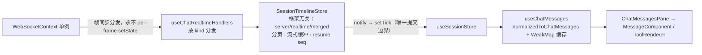

# 聊天链路（Chat Pipeline）

> **核心文档**：改动 `server/modules/websocket/**` 或 `src/modules/chat/**` 时**必须同步更新本文**。
> 普通 bug 修复不动架构的不需要更新（提交时走 `--no-verify`，见 `AGENTS.md`）。

一个值得先记住的模型：**同一段对话有两条路**。实时事件从 WebSocket 下来，持久化历史从 REST 上去，前端 store 把两者分数组保存、合并渲染。这个区域的大部分诡异行为（重复消息、闪空、乱序）都是两条路不一致造成的。

深度细节（帧表、握手、滚动、工具视图的逐文件分析）在上游自带文档 `docs/architecture/`（英文，6 篇）。**注意**：其中《04 message store》《05 scrolling》写作早于本 fork 的重构，消息存储与滚动以本文为准。

## 发送侧：一次 turn 的旅程（服务端）

| 步骤 | 位置 |
| --- | --- |
| 会话先创建（REST） | `POST /api/providers/sessions` → `sessionsService.createAppSession` → `sessionsDb`；app session id 是服务端生成的 `randomUUID`，URL/帧/store 全用它 |
| `chat.send` 入口 | `server/modules/websocket/services/chat-websocket.service.ts` 的 `handleChatSend`：`resolveSendTarget`（会话行以 DB 为准，不信任客户端）→ `dispatchRun`（附件过滤只放行 `~/.cloudcli/assets` 直接子文件、记录 model/effort） |
| 运行登记 | `chat-run-registry.service.ts`：`startRun` / `replayEvents` / `completeRunIfCurrent`；**run 属于服务端不属于 socket**——断线存活、多端同看、无观察者也能跑；完成后事件缓冲保留约 5 分钟供补发 |
| 统一分发 | `server/modules/providers/services/provider-runtime.service.ts` → `IProviderRuntime.run(command, options, writer, context)` |
| 出站写入 | `chat-session-writer.service.ts`（`ChatSessionWriter`）：吞掉 `session_created`、把 provider 原生 id 重映射为 app session id、给每事件打**单调 `seq`**、扇出给所有 watching socket |
| 终态 | 每次运行**恰好一个 `complete`**（成功/失败/中止都是）；`error` 是信息性行，不终止 run |

## 断线恢复

- `seq` 由 run registry 按 session 维护单调水位：跨 run 续数、不随缓冲驱逐失效，服务端单方定义，客户端只透传（取 max 对账）。重连后发 `chat.subscribe`（带 `lastSeq`）→ 活跃 run 从缓冲精确补发；ack 带权威 `lastSeq` 与 `stale` 标志——`stale: true` 表示 `lastSeq` 已落在缓冲窗之前（5000 条上限 / 5 分钟保留），客户端补一次 REST 刷新。完成态 run 不 replay，走 REST。
- WS 鉴权用 query token 或 Authorization 头（`websocket-auth.service.ts`）；30s 心跳在 `websocket-server.service.ts`。
- `websocket_reconnected` 帧是前端 `src/shared/context/WebSocketContext.tsx` 本地合成的，用于各订阅方追赶。

## 权限批准

- 引擎运行时发 `permission_request` 帧 → 前端 `src/modules/chat/context/PermissionContext.tsx` → 用户应答 `chat.permission-response` → `chat-websocket.service.ts` `handlePermissionResponse` → `providerRuntimeService.resolveToolApproval` 广播到各引擎的 `permissions` 网关（`server/shared/types.ts` `ProviderRuntimePermissionGateway`）。
- `chat.subscribe` 应答（`chat_subscribed`）携带处理中状态与挂起权限，多标签/重连后权限卡不丢（历史教训：挂起列表裸字符串契约破裂产生"僵尸权限卡"，已由形状校验 + `toolCallId` 缓存键收口）。
- 引擎侧：claude 走 SDK 桥；zcode 走引擎权限桥 + 四档权限模式映射（`chat.send` 的 `options.permissionMode` → 引擎 set_mode）。能力有无由矩阵的 `supportsPermissionRequests` 表达。

## 落盘同步（run 之外的第二条持久化路）

run 结束 → `sessions-watcher.service.ts`（chokidar，watch 根由各引擎 `getSessionWatchTarget()` 声明）→ `session-synchronizer.service.ts` `synchronizeFile` → `sessionsDb` upsert → `session-upserted-broadcast.service.ts` 推 `session_upserted`（侧边栏增量，归 projects 状态管，不归 chat）。历史读取走 `GET /api/providers/sessions/:sessionId/messages`（尾偏移分页：`offset: 0` 是最新一页），读密集缓存见 `session-history-cache.service.ts`。

## 接收侧：WS 帧 → React 的四层

- **`src/shared/context/WebSocketContext.tsx`**：全局单例，`subscribe(listener)`；帧绝不直接进 React state。
- **`src/modules/chat/hooks/useChatRealtimeHandlers.ts`**：唯一一处按 `kind` 的协议分发，把消息写进 store（`appendRealtime` / `noteSeq` / `truncateAt`），另处理权限请求、通知音、重连追赶。
- **`src/modules/chat/utils/sessionTimelineStore.ts`**（`SessionTimelineStore`）：不 import React。每会话一个 slot（`serverMessages` / `realtimeMessages` / `merged` + 分页元数据 + 流式分段缓冲 + 重连 resume seq）。
- **`src/modules/chat/hooks/useSessionStore.ts`**：React 适配器，每次应用挂载建一个 store，`notify` 触发重渲染——**非 React → React 的唯一提交边界**。

### 两条硬不变量（store 与渲染器的契约，方法实现必须保持）

1. **行身份复用**：前翻旧页或替换尾部时，字节等价的行对象必须复用缓存实例——React memo、转换缓存、DOM 锚定全靠它。
2. **更新只有两种形态**：按消息 id / toolId 的原地 upsert（思考、tool_use、流式行），或保持等价行身份的全量替换。没有第三种。

模块内还有三条次级排序契约（都曾是真实 bug），见 `sessionTimelineStore.ts` 头注释：服务端覆盖剪枝必须先于内容级短路；旧页拉取期间的偏移漂移要先做一次有界最新页校准；流式行时间戳锚定在分段开始且不刷新。

工具卡的跨路去重按 `toolIdentity.ts` 匹配：精确 toolId，或"工具名 + 完整参数指纹"（claimed 一对一，按 realtime 顺序配对）——两路对同一调用各自发 id（live 引擎 payload 兜底 vs 转录 part id），精确 id 不是身份的全部；`__finalized_` 合成结算行随其卡片退役。逐引擎定论（2026-09 可行域调查）：claude（共用归一化器）与 zcode（引擎持久化 `callID = toolCallId`，28k 真实行 0 缺失）两路 id 天然同源，有 parity 测试钉住；codex（live `item_<n>` 本地合成、rollout `call_id` 不在 wire 格式）、antigravity（live 锚执行步/历史锚 planner 步+下标）、opencode（无真实 live 样本）**结构性无法对齐，指纹层是其永久机制**，勿再立项对齐。

### 渲染性能优化

- 思考块按稳定 id 归组 upsert（`src/modules/chat/utils/sessionThinkingRows.ts`）。
- 流式文本由 `transcript/StreamingMarkdown.tsx` 渲染：按 `streamingMarkdown.ts` 切"已定稿前缀 + 待定尾块"两段 `MarkdownBody`，前缀字节稳定命中 memo，每 100ms tick 只重解析尾块。
- 搜索跳转先按 `searchTargetLocator.ts` 在数据上解析命中下标（-1 即确定性放弃），再按 `resolveSearchWindowSize` 只渲染命中窗口（不再整转录渲染），DOM 定位走 `LazyMessageRow` 包装层常驻的时间戳锚。
- 工具卡片按 toolId upsert，服务端把引擎的流式参数增量累积成稳定快照再发。
- 视口懒挂载与滚动锚定见 [frontend.md](./frontend.md) 的性能守则。

## 扩展检查单

| 要做什么 | 改哪里 |
| --- | --- |
| 新增服务端 → 客户端事件 | `server/shared/types.ts` 的 `ServerEventKind` + 引擎归一化层产出 + 前端 `useChatRealtimeHandlers` 分发 + store 处理（遵守两条不变量）+ 更新本文 |
| 新增客户端 → 服务端帧 | `chat-websocket.service.ts` 的消息类型 switch；需要鉴权/限流语义时看 `resolveSendTarget` 的模式 |
| 新增工具卡片渲染 | `src/modules/chat/tools/configs/toolConfigs.ts` 注册（配置驱动，**禁止散落条件分支**），复杂内容加 ContentRenderer；见 `src/modules/chat/tools/README.md` |
| 新增权限相关能力 | 引擎 runtime 的 `permissions` 网关 → 矩阵自动推导 `supportsPermissionRequests` → 前端按矩阵渲染 |
| 改历史分页 | `src/modules/chat/utils/sessionMessagePagination.ts` + store 的序列化测试（`sessionTimelineSequences.test.ts`）必须跟着改 |
