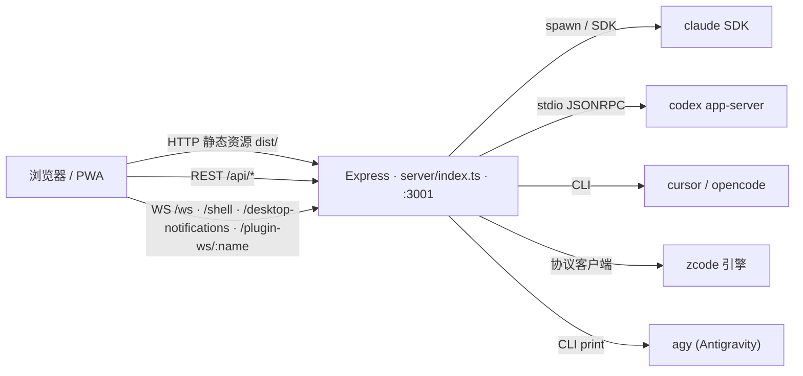

# 系统全景（Overview）

> **核心文档**：本文描述整个系统的进程拓扑、目录地图、数据分布与部署方式。
> 改动 `server/index.ts`、数据库 schema、构建产物结构或部署方式时**必须同步更新本文**。
> 普通 bug 修复不动架构的不需要更新（提交时走 `--no-verify`，见 `AGENTS.md`）。

其他核心文档：[providers.md](./providers.md)（引擎接入）· [chat.md](./chat.md)（聊天链路）· [frontend.md](./frontend.md)（前端架构）

## 进程拓扑

整个产品是**一个 Node 进程**：Express 同时提供静态资源、REST API 和 WebSocket。



要点：

- **服务端是引擎的宿主**，不是代理。引擎子进程/SDK 由服务端拉起，会话原件落盘在各引擎自己的数据目录，服务端只做索引、归一化与转发。
- 入口 `server/index.ts`：组装 Express、挂全部 REST 路由、挂 WS（`server/modules/websocket`）、托管 `dist/`、SPA fallback、优雅停机。
- 端口：`SERVER_PORT` 默认 **3001**，`HOST` 默认 `0.0.0.0`；开发模式 Vite 跑 5173 并把 API 代理到 3001（`vite.config.js`）。
- 启动标记：`~/.cloudcli/local-server.json`（host/port/pid/appRoot），用于 CLI 与健康检查定位实例。

## 目录地图（两层）

```
server/
  index.ts                 进程入口：路由挂载、静态资源、WS、监听与停机
  load-env.ts              最早加载 .env；DATABASE_PATH 默认 ~/.cloudcli/auth.db
  modules/
    providers/             ★ 引擎接入层（registry + 6 家 provider + services），见 providers.md
    websocket/             ★ WS 网关（/ws 聊天、/shell 终端、通知、插件代理），见 chat.md
    auth/                  JWT 注册/登录/刷新 + authenticateToken 中间件
    database/              better-sqlite3 连接、schema、migrations、repositories（18 张表）
    assets/                聊天上传资产（~/.cloudcli/assets）的上传与读取
    agent/                 无头 Agent API（API key / 平台模式鉴权）
    notifications/         Web Push（VAPID）+ 桌面通知 WS
    plugins/               插件注册表、插件子进程、WS 代理
    scheduled-messages/    定时消息（一次性：调度器 → 无附着 chat turn）
    scheduled-jobs/        定时任务（cron 循环或 run_at 仅一次 + 运行历史；reuse/new 两种会话模式，永不打断在跑回合）
                           含 agent 侧受管 MCP 桥 `cloudcli-scheduled-tasks`（Settings 全局开关 + 启动对账）
    browser-use/           浏览器自动化 service + 本地 MCP 桥接
    local-proxy/           把服务器本机端口上的服务转发给远程浏览器（票据 + 会话 cookie）
    voice/  cli/  git/  file-tree/  worktrees/  projects/  settings/  system/  user/
                           其余领域模块（每个 = routes + services 的薄模块）
  shared/                  interfaces.ts（IProvider 契约）、types.ts（NormalizedMessage、
                           ServerEventKind 等）、message-unification.ts、utils.ts
src/
  modules/
    chat/                  ★ 聊天前端（composer、transcript、tools、实时 hooks、store、导出）
    project-workspace/     工作区外壳（布局、标签页、项目/会话列表状态）
    sidebar/  settings/  auth/  provider-auth/  mcp/  skills/  git-panel/  file-tree/
    code-editor/  shell/  standalone-shell/  i18n/  plugins/  browser-use/
    scheduled-jobs/        工作区 Scheduled 标签页 + composer 任务入口（循环/仅一次，见 chat.md / frontend.md）
    voice/  task-master/  command-palette/  onboarding/  quick-settings-panel/  …
  shared/                  api.ts（fetch 封装）、types.ts、context/（全局 Context）、ui/（通用组件 + 引擎 Logo）
  App.tsx                  路由：/ 与 /session/:sessionId 两个工作区路由
docs/
  core/                    ★ 本套核心文档（中文）
  architecture/            上游自带的聊天运行时深度文档（英文，6+1 篇）
  README.upstream.md       上游原始英文 README 备份
```

## 数据与持久化

| 数据 | 位置 | 说明 |
| --- | --- | --- |
| SQLite（账号/会话元数据/配置） | `~/.cloudcli/auth.db`（`DATABASE_PATH` 可改） | 18 张表：users、api_keys、user_credentials、projects、sessions、app_config、provider_models、user_preferences、session_drafts、scheduled_messages、scheduled_jobs、scheduled_job_runs、notification 系列、vapid_keys、push_subscriptions、scan_state、superseded_provider_sessions。连接单例 `server/modules/database/connection.ts`，表定义 `schema.ts`，迁移 `migrations.ts` |
| 聊天上传资产 | `~/.cloudcli/assets` | `server/modules/assets`；聊天发送只信任该目录**直接子文件**（`chat-websocket.service.ts` 过滤） |
| 插件本体与启用状态 | `~/.cloudcli/plugins` + `~/.cloudcli/plugins.json` | `server/modules/plugins`（注册表扫描 + 子进程管理）；首次访问时从旧 `~/.claude-code-ui` 一次性自动迁移（`migrateLegacyPluginPaths`） |
| 各引擎会话原件 | `~/.claude` / `~/.codex` / `~/.cursor` / `~/.local/share/opencode` / `~/.zcode` / `~/.gemini/antigravity*` | 云 CLI 不复制、不改写；同步器只读解析后把元数据 upsert 进 SQLite（`sessions` 表含 `jsonl_path`）。`sessions` 还记会话的运行时事实：`model`、`effort`、`context_window`（引擎自报的真实上下文窗口，转录里推不出来；未跑过的会话为 NULL） |
| 运行结束记录 | 服务进程内存（有界，约百条） | `server/modules/diagnostics`：每个 run 为什么结束（见 [chat.md](./chat.md)）。刻意不入库——它服务于"刚刚出了什么事"，重启即弃；`GET /api/diagnostics/runs` 读出，前端诊断报告把它和浏览器侧证据合成一份文件 |
| 前端构建产物 | `dist/`（vite build） | Express 静态托管 + SPA fallback |
| 服务端构建产物 | `dist-server/` | `tsc + tsc-alias` 先产出 `dist-server.next`，`scripts/promote-dist-server.mjs` 原子晋升（保留 `dist-server.old`；`preserver` 钩子启动前自愈） |

**数据库改动规则**：改 `schema.ts` 必须同时写 `migrations.ts` 增量迁移（初始化走 INIT_SCHEMA_SQL，存量库走迁移链），并更新本文。

## 认证与安全边界

- **JWT**：`server/modules/auth/auth.middleware.ts`。密钥取 env `JWT_SECRET`，否则自动生成入库（`app_config.jwt_secret`）。token 7 天有效，半衰期自动刷新（响应头 `X-Refreshed-Token`）。WS 走 query string 或 Authorization 头鉴权（`websocket-auth.service.ts`）。
- **可选 API key**：`validateApiKey` 作用于全部 `/api`；agent 模块另走 API key / 平台双模鉴权。
- **上传白名单**：`chat.send` 的附件只放行 `~/.cloudcli/assets` 直接子文件，防止任意路径读。
- **`file:` 链接白名单**：会话里引擎产出的本地文件链接走只读端点，目录白名单含各引擎数据根与系统临时目录（`server` 侧 fileLink 相关服务），防止越权读盘。
- **本机服务代理**（`server/modules/local-proxy`）：聊天里出现的 `http://localhost:<port>/…` 只在服务器那台机器上可达，远程浏览器打不开。前端（`src/modules/chat/utils/localProxyLink.ts`）在"链接指向本机、而页面自身不是本机地址"时改走代理：先用 JWT 换一张 60 秒一次性票据，首个文档请求用票据换 `HttpOnly` 会话 cookie（`Path=/api/local-proxy`，8 小时）并 302 把票据从地址栏抹掉，之后页面的子资源靠该 cookie 放行——浏览器不会给它们带 Authorization 头。转发只允许 GET/HEAD，目标 host 固定 `127.0.0.1`，禁服务自身端口；请求侧丢掉 `cookie`/`authorization`，响应侧剥掉 `set-cookie`/CSP/HSTS 并把 `Location` 改写回代理前缀。页面里写死的根绝对路径资源由 `localProxyAbsolutePathFallback` 按 `Referer` 送回对应端口，该中间件必须排在静态资源处理之前。
- **代理的固有代价**：任何已登录用户都能读到服务器本机任意端口的 GET 内容；被代理页面运行在 cloudcli 同源下，其脚本能访问本源的 `localStorage`。代理的对象是用户自己机器上的本地服务，以此为前提接受这两点。

## 构建与部署

```bash
npm run build        # build:client (vite → dist/) + build:server (tsc → dist-server 原子晋升)
npm run server       # node dist-server/server/index.js —— 生产启动就这一个进程
npm run dev          # tsx 跑 server(3001) + vite HMR(5173)，开发用
npm test             # 服务端测试（tsx --test server/**/*.test.ts）
npm run test:client  # 前端测试（vitest）
npm run lint         # oxlint src/ server/
npm run typecheck    # 前后端双 tsconfig --noEmit
```

- 本仓库生产实例用 **PM2** 托管，应用名为 `cloudcli`。`pnpm run deploy` 用部署锁串行执行，先构建 tarball，在独立的 `~/.cloudcli/runtime-next-<pid>` 完成生产依赖安装和原生依赖检查，再受控切换为 `~/.cloudcli/runtime`；服务入口固定为 `~/.cloudcli/runtime/node_modules/cloudcli/dist-server/server/index.js`，上一版保留在 `~/.cloudcli/runtime-previous`，启动或健康检查失败时自动恢复。首次从其他入口迁移时会重建 PM2 进程条目，固定入口生效后的部署只做原地重启。全局 `cloudcli` 命令稳定指向该运行目录。部署脚本启动时会把自己重新拉起成 detached 后台进程（日志 `~/.cloudcli/deploy.log`），调用方只跟读日志——终端关闭或 pm2 切换重启了托管调用方的服务，都不会让部署停在半路；中断时 exit 钩子清理暂存目录并明确告知线上未变更。PM2 配置在宿主机，不在仓库内；重启会切断在线 WebSocket（详见根目录 `AGENTS.md`）。
- **UI 自更新**（仅"仓库目录安装 + PM2 托管"）：`server/modules/system` 定时 `git fetch` 当前分支的上游，与本地 HEAD、运行中构建（`dist/build-info.json`，vite 构建时写入完整 commit）比较——落后上游给「更新并重启」，HEAD 超前于运行构建（本机提交后没构建）给「构建并重启」。点击后服务端只写 `~/.cloudcli/update-state.json` 并拉起 `scripts/self-update.mjs`：它先二次 detach 脱离服务进程树（否则 PM2 的 tree-kill 会连带杀掉它），再 ff-only 拉取 → 依赖变了才停服务装依赖 → 前端构建到 `dist.next`、服务端照常原子晋升 → 替换 `dist` → `pm2 restart`，日志 `~/.cloudcli/update.log`。任一步失败则 `git reset --keep` 回原提交、丢弃暂存产物、拉起服务。脚本的最后一步是重启自己所在的服务，看不到结果，所以由新启动的服务按"启动的构建是否等于目标 commit"判定成功或失败。工作区有未提交改动、与上游分叉、非 git 安装或不在 PM2 下时拒绝执行，并在 UI 上说明原因。仓库链接与 star 角标统一指向 `src/shared/constants.ts` 的 `GITHUB_REPO_*`，不再查询任何 GitHub release。
- 提交钩子：husky + lint-staged（oxlint）+ commitlint（Conventional Commits）+ 核心文档同步守卫（`scripts/hooks/check-doc-sync.mjs`）。

## 扩展检查单

| 要做什么 | 看哪里 |
| --- | --- |
| 新增 REST 领域模块 | 按 `.agents/skills/backend-module-standards` 的模块规范：`server/modules/<域>/`（routes + services），在 `server/index.ts` 挂路由 |
| 新增/改数据库表 | `database/schema.ts` + `migrations.ts` + `database/repositories/`，并更新本文 |
| 新增引擎 | [providers.md](./providers.md) 的六步清单 |
| 新增 WS 消息类型 | [chat.md](./chat.md) 的扩展检查单 |
| 新增前端大块 UI | [frontend.md](./frontend.md) + `.agents/skills/frontend-module-standards` |
