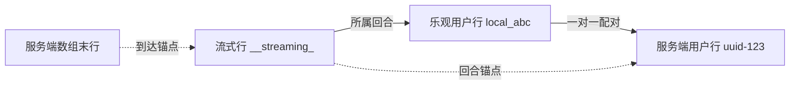

# 时间线排序权威化（阶段 0：止血）

> 状态：已实施（2026-09-18）
> 范围：`src/modules/chat/utils/` 三个纯函数模块 + 测试 + `docs/core/chat.md`
> 目标：消除「实时流式行排到用户消息前面」这一类跨源乱序，并让它不可复发

## 问题本质

前端时间线有两条数据源：`serverMessages`（REST 历史）与 `realtimeMessages`（WebSocket 实时）。
**每条源内部的顺序都是对的**——历史是转录顺序，实时是到达顺序，都是因果序。
错的只有**两源如何交错**：`stableMergeMessageSources` 调用 `compareMessagesChronologically`，
而后者只比 `Date.parse(timestamp)`。

这两个时间戳来自不同机器：

| 行 | 时间戳来源 |
| --- | --- |
| `__streaming_` 流式行 | 浏览器 `new Date()`（`sessionTimelineStore.ts` `updateStreaming`） |
| 历史用户行 | 引擎落盘时写入 JSONL 的字段 |

发送瞬间不出错——此时用户行还是乐观行 `local_`，与流式行同在 `realtimeMessages`，按数组序走。
历史刷新到达后 `removeOptimisticUserEchoes` 摘掉乐观行，用户行换成服务端那条，
流式行与用户行分处两源，于是拿**两台机器的挂钟**决定先后。浏览器时钟稍慢，流式行就翻到前面。

这解释了该现象的三个特征：间歇发生、远程/移动端更明显、按症状修了还犯。

同一套代码里已有自相矛盾的铁证：`sessionMessageReconciliation.ts` 定义
`LOCAL_USER_DEDUPE_CLOCK_SKEW_MS = 10_000`，明确承认两端时钟可差 10 秒；
而隔壁的排序比较零容差，以毫秒定胜负。

## 两个候选权威序号为何都不成立

**run registry 的 `seq`**：`sessionWatermarks` 是进程内存 Map，重启即丢；
历史行从 JSONL/DB 重读，与 seq 无因果关系，重启后无法赋予可比编号。
它作为「断线补发游标」是正确的，扩用途会把一个可靠机制变脆。

**provider 转录行序 `sequence`**：字段已存在，但只有 cursor、zcode、antigravity 填充，
claude / codex / opencode 未填。更关键的是流式行**在落盘前根本拿不到转录行序**，
所以它天然无法参与实时与历史的交错裁决。

结论：**跨源排序不该找「全局序号」，该找「因果锚点」。**

## 方案：两个因果锚点取代挂钟

`findServerEchoForLocalUser` 已经在做一件正确的事——把乐观用户行与服务端用户行一对一配对。
这个结果原本用完即弃，只拿去删行。把它留下来当排序锚，跨源顺序就不必再问时钟。

排序依据改为 **源内顺序 > 因果锚点 > 时间戳**。每条实时行取两个下界中较晚的一个，
有下界时时间戳完全不参与：

**回合锚点**覆盖「服务端还没跟上」：实时行属于其上方最近一条乐观用户行开启的回合，
该乐观行被持久化副本顶替时，顶替它的服务端行即成为这一回合所有实时行的下界。

**到达锚点**覆盖「服务端早已有」：实时行首次出现时服务端数组的末行，只记一次不修正——
当时已在转录里的行必然发生在它之前。他端标签页与重连后补看的会话没有乐观行可锚，
靠的是这一条。

两者互补而非二选一，所以取较晚者。两个锚点都不适用的行才退回时间戳排列。

一个连带约束：剪枝阶段**必须保留乐观用户行**。它是回合边界的唯一记录，
原先在 `pruneRealtimeSupersededByServer` 里被物理删除，锚点随之消失；
隐藏它是合并阶段（`reconcileOptimisticUserEchoes`）的职责，不是剪枝的。

## 实施步骤（TDD）

1. **RED**：构造浏览器时钟比引擎慢 2 秒的两个场景——发送端（有乐观行）与观察端（无乐观行），
   断言流式行位于用户消息之后。两者在改动前均失败。
2. `sessionMessageReconciliation.ts`：`reconcileOptimisticUserEchoes` 同时产出配对映射。
3. `sessionTimelineStore.ts`：剪枝保留乐观用户行；slot 增加 `realtimeArrivalAnchors`；
   `resolveRealtimeFloors` 合成两个下界；`stableMergeMessageSources` 按下界扣住实时行。
4. **GREEN**：两个新测试通过，既有测试无一需要改期望值。
5. 同步 `docs/core/chat.md` 的排序契约段落。

## 验收

- 两个复现测试（发送端 / 观察端，时钟偏斜下的流式与用户行顺序）通过
- 前端 71 个测试文件全绿，无一处期望值为迁就实现而改动
- 前后端 `typecheck` 通过，改动文件 lint 零新增告警
- 现有两条硬不变量（行身份复用、更新只有两种形态）不被破坏：
  锚点记在 slot 上而非写进消息对象，行身份不受影响

## 与后续阶段的关系

本阶段不触碰 `NormalizedMessage` 的类型形状，也不动任何 provider。
它是阶段 1（判别联合 + 运行时校验 + 能力矩阵收口）的前置：
先让时间线有确定的因果语义，后续替换类型与 adapter 时才有可信的回归基线。
